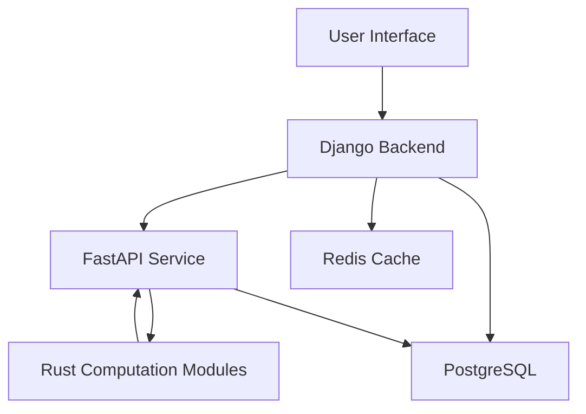

# Pea Protein Extraction Process Analysis System
## Comprehensive Project Development Plan

## Table of Contents
1. [Project Overview](#1-project-overview)
2. [Technical Architecture](#2-technical-architecture)
3. [Project Structure](#3-project-structure)
4. [Core System Components](#4-core-system-components)
5. [Mathematical Models and Algorithms](#5-mathematical-models-and-algorithms)
6. [API Design and Endpoints](#6-api-design-and-endpoints)
7. [Data Flow and Component Integration](#7-data-flow-and-component-integration)
8. [Development Phases](#8-development-phases)
9. [Testing Strategy](#9-testing-strategy)
10. [Deployment Strategy](#10-deployment-strategy)
11. [Documentation Requirements](#11-documentation-requirements)

## 1. Project Overview

### 1.1 Objective
Development of a comprehensive backend system for analyzing and optimizing pea protein extraction processes, based on academic research implementing:
- Protein recovery tracking
- Economic analysis (CAPEX, OPEX, NPV)
- Environmental impact assessment
- Eco-efficiency analysis
- Uncertainty and sensitivity analysis

### 1.2 Technology Stack
- **Django**: Core application framework, user management, data handling
- **FastAPI**: Process-specific APIs, real-time calculations
- **Rust**: High-performance computations, simulations
- **PostgreSQL**: Primary database
- **Docker/Kubernetes**: Containerization and orchestration
- **Frontend** (optional): React/Angular for visualization

## 2. Technical Architecture

### 2.1 Component Overview
1. **Django Application**
   - User authentication and authorization
   - Database management and ORM
   - Task scheduling (Celery)
   - Result aggregation and reporting

2. **FastAPI Application**
   - Process-specific calculations
   - Real-time analysis endpoints
   - Integration with Rust modules
   - Data validation and preprocessing

3. **Rust Modules**
   - Monte Carlo simulations
   - Sensitivity analysis
   - Matrix operations
   - Performance optimization

4. **Database Layer**
   - PostgreSQL for persistent storage
   - Redis for caching
   - Time-series data management

### 2.2 Integration Architecture


## 3. Project Structure

```plaintext
project_root/
├── backend/
│   ├── django_app/
│   │   ├── settings/
│   │   │   ├── __init__.py
│   │   │   ├── base.py
│   │   │   ├── development.py
│   │   │   ├── production.py
│   │   ├── core/
│   │   │   ├── __init__.py
│   │   │   ├── models.py
│   │   │   ├── views.py
│   │   │   ├── serializers.py
│   │   │   ├── urls.py
│   │   │   ├── tasks.py
│   │   ├── analysis/
│   │   │   ├── models/
│   │   │   │   ├── process.py
│   │   │   │   ├── equipment.py
│   │   │   │   ├── costs.py
│   │   │   ├── services/
│   │   │   │   ├── calculations.py
│   │   │   │   ├── validators.py
│   │   ├── authentication/
│   │   │   ├── models.py
│   │   │   ├── views.py
│   │   └── manage.py
│   ├── fastapi_app/
│   │   ├── main.py
│   │   ├── api/
│   │   │   ├── endpoints/
│   │   │   │   ├── protein_recovery.py
│   │   │   │   ├── economic_analysis.py
│   │   │   │   ├── environmental_impact.py
│   │   │   │   ├── eco_efficiency.py
│   │   │   │   ├── uncertainty_analysis.py
│   │   │   │   ├── sensitivity_analysis.py
│   │   ├── services/
│   │   │   ├── calculations.py
│   │   │   ├── helpers.py
│   │   ├── models/
│   │   │   ├── protein.py
│   │   │   ├── economics.py
│   │   │   ├── environment.py
│   │   ├── tests/
│   │   │   ├── test_protein_recovery.py
│   │   │   ├── test_eco_efficiency.py
│   ├── rust_modules/
│   │   ├── src/
│   │   │   ├── lib.rs
│   │   │   ├── monte_carlo.rs
│   │   │   ├── sensitivity.rs
│   │   │   ├── matrix_ops.rs
│   │   │   ├── tests/
│   │   │   │   ├── monte_carlo_tests.rs
│   │   │   │   ├── sensitivity_tests.rs
│   │   └── Cargo.toml
│   ├── requirements/
│   │   ├── base.txt
│   │   ├── development.txt
│   │   ├── production.txt
│   ├── Dockerfile
│   ├── docker-compose.yml
├── database/
│   ├── migrations/
│   ├── scripts/
│   │   ├── init_db.sql
│   ├── Dockerfile
├── tests/
│   ├── integration/
│   ├── unit/
├── docs/
└── Makefile
```

## 4. Core System Components

### 4.1 Django Models
```python
# core/models.py
class Equipment(models.Model):
    name = models.CharField(max_length=100)
    cost = models.DecimalField(max_digits=10, decimal_places=2)
    efficiency = models.FloatField()
    maintenance_cost = models.DecimalField()

class ProcessStep(models.Model):
    name = models.CharField(max_length=100)
    input_mass = models.FloatField()
    output_mass = models.FloatField()
    protein_content = models.FloatField()
    equipment = models.ForeignKey(Equipment)

class Analysis(models.Model):
    date = models.DateTimeField(auto_now_add=True)
    process_steps = models.ManyToManyField(ProcessStep)
    results = JSONField()
```

### 4.2 FastAPI Services
```python
# services/calculations.py
class ProteinRecoveryService:
    def protein_recovery(input_mass: float, output_mass: float, protein_purity: float) -> float:
        return (output_mass * protein_purity) / input_mass * 100


    def track_losses(self, steps: List[ProcessStep]) -> Dict[str, float]:
        losses = {}
        for step in steps:
            losses[step.name] = step.input_mass - step.output_mass
        return losses

class EconomicAnalysisService:
    def calculate_npv(self, cash_flows: List[float], 
                     rate: float, 
                     initial_investment: float) -> float:
        npv = -initial_investment
        for t, cf in enumerate(cash_flows, 1):
            npv += cf / (1 + rate) ** t
        return npv
```

### 4.3 Rust Modules
```rust
// monte_carlo.rs
pub struct MonteCarloSimulation {
    trials: usize,
    parameters: Vec<Parameter>,
}

impl MonteCarloSimulation {
    pub fn run(&self) -> Vec<f64> {
        let mut results = Vec::with_capacity(self.trials);
        for _ in 0..self.trials {
            let sample = self.sample_parameters();
            results.push(self.calculate_outcome(sample));
        }
        results
    }
}

// sensitivity.rs
pub fn calculate_sensitivity_index(
    parameter_variance: f64,
    total_variance: f64
) -> f64 {
    parameter_variance / total_variance
}
```

## 5. Mathematical Models and Algorithms

### 5.1 Protein Recovery Calculations
```python
def protein_recovery(input_mass: float, output_mass: float, 
                    waste_mass: float) -> float:
    """
    Calculate protein recovery rate
    """
    return (output_mass / input_mass) * 100

def protein_loss_tracking(steps: List[ProcessStep]) -> Dict[str, float]:
    """
    Track protein losses through process steps
    """
    losses = {}
    for step in steps:
        loss = step.input_protein - step.output_protein - step.waste_protein
        losses[step.name] = loss
    return losses
```

### 5.2 Economic Analysis
Net Present Value (NPV):
```python
def calculate_npv(cash_flows: List[float], 
                 rate: float, 
                 initial_investment: float) -> float:
    """
    Calculate Net Present Value
    NPV = Σ(t=1 to n)[(Rt - Ct)/(1 + r)^t] - Initial Investment
    """
    npv = -initial_investment
    for t, cf in enumerate(cash_flows, 1):
        npv += cf / (1 + rate) ** t
    return npv

def calculate_roi(net_profit: float, 
                 investment: float) -> float:
    """
    Calculate Return on Investment
    ROI = (Net Annual Profit / Initial Investment) × 100
    """
    return (net_profit / investment) * 100
```

### 5.3 Environmental Impact Assessment
```python
def calculate_environmental_impact(flows: Dict[str, float], 
                                emission_factors: Dict[str, float]) -> float:
    """
    Calculate environmental impact
    Ic = Σ(Fi × Ei)
    """
    impact = sum(flow * emission_factors[input_type] 
                for input_type, flow in flows.items())
    return impact
```

### 5.4 Eco-efficiency Indicators
```python
def calculate_eco_efficiency(economic_value: float, 
                           environmental_impact: float) -> float:
    """
    Calculate eco-efficiency indicators
    EEe = Economic Value / Environmental Impact
    """
    return economic_value / environmental_impact

def calculate_quality_eco_efficiency(protein_purity: float, 
                                   environmental_impact: float) -> float:
    """
    Calculate quality-based eco-efficiency
    EEq = Protein Purity / Environmental Impact
    """
    return protein_purity / environmental_impact
```

## 6. API Design and Endpoints

### 6.1 Django APIs
```python
# Authentication
POST /api/auth/register/
POST /api/auth/login/
GET /api/auth/logout/

# Data Management
POST /api/data/upload/
GET /api/data/{id}/
PUT /api/data/{id}/
DELETE /api/data/{id}/

# Analysis Results
GET /api/results/{analysis_id}/
GET /api/results/export/{format}/
```

### 6.2 FastAPI Endpoints
```python
# Process Analysis
POST /process/protein-recovery/
POST /process/economic-analysis/
POST /process/environmental-impact/
POST /process/eco-efficiency/

# Simulation and Analysis
POST /process/uncertainty-analysis/
POST /process/sensitivity-analysis/
```

### 6.3 API Documentation
```yaml
# protein_recovery.py
@router.post("/protein-recovery/")
async def calculate_protein_recovery(
    input_data: ProteinRecoveryInput
) -> ProteinRecoveryResult:
    """
    Calculate protein recovery for process steps
    
    Parameters:
    - input_mass: float
    - output_mass: float
    - waste_mass: float
    
    Returns:
    - recovery_rate: float
    - losses: Dict[str, float]
    """
```

## 7. Data Flow and Component Integration

### 7.1 Django to FastAPI Integration
```python
# Django service calling FastAPI
class AnalysisService:
    async def trigger_analysis(self, data: Dict) -> Dict:
        async with httpx.AsyncClient() as client:
            response = await client.post(
                f"{FASTAPI_URL}/process/protein-recovery/",
                json=data
            )
            return response.json()
```

### 7.2 FastAPI to Rust Integration
```python
# FastAPI calling Rust module
from rust_module import monte_carlo_simulation

async def run_monte_carlo(data: Dict) -> List[float]:
    results = monte_carlo_simulation(
        data=data,
        num_trials=10000
    )
    return results
```

## 8. Development Phases

### Phase 1: Foundation (Weeks 1-4)
1. Project setup and environment configuration
2. Database schema design and implementation
3. Basic Django application setup
4. User authentication system

### Phase 2: Core Functionality (Weeks 5-8)
1. Protein recovery tracking implementation
2. Economic analysis modules
3. Environmental impact assessment
4. FastAPI service development

### Phase 3: Advanced Features (Weeks 9-12)
1. Rust module integration
2. Monte Carlo simulation implementation
3. Sensitivity analysis
4. Performance optimization

### Phase 4: Integration and Testing (Weeks 13-16)
1. Component integration
2. Comprehensive testing
3. Documentation
4. Deployment preparation

## 9. Testing Strategy

### 9.1 Unit Tests
```python
# test_protein_recovery.py
def test_protein_recovery_calculation():
    service = ProteinRecoveryService()
    result = service.calculate_recovery(
        input_mass=100,
        output_mass=80
    )
    assert result == 80.0

# test_economic_analysis.py
def test_npv_calculation():
    service = EconomicAnalysisService()
    npv = service.calculate_npv(
        cash_flows=[100, 200, 300],
        rate=0.1,
        initial_investment=500
    )
    assert npv > 0
```

### 9.2 Integration Tests
```python
# test_api_integration.py
async def test_full_analysis_flow():
    # Test complete analysis workflow
    data = load_test_data()
    
    # Upload data
    response = await client.post("/data/upload/", json=data)
    assert response.status_code == 200
    
    # Trigger analysis
    analysis_id = response.json()["id"]
    response = await client.post(
        f"/process/analyze/{analysis_id}/"
    )
    assert response.status_code == 200
    
    # Verify results
    results = response.json()
    assert "protein_recovery" in results
    assert "npv" in results
    assert "environmental_impact" in results
```

## 10. Deployment Strategy

### 10.1 Docker Configuration
```yaml
# docker-compose.yml
version: '3.8'

services:
  django:
    build: ./backend/django_app
    ports:
      - "8000:8000"
    depends_on:
      - postgres
      - redis

  fastapi:
    build: ./backend/fastapi_app
    ports:
      - "