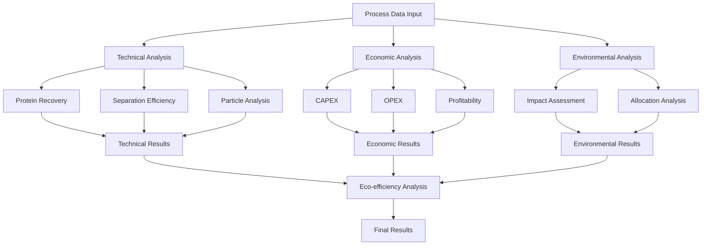

## 7. Data Flow and Component Integration

### 7.1 Analysis Pipeline Integration
```python
class AnalysisPipeline:
    def __init__(self):
        self.client = httpx.AsyncClient()
        self.process_cache = {}

    async def analyze_process(self, process_type: str, data: Dict) -> Dict:
        """Complete process analysis pipeline"""
        technical_results = await self._technical_analysis(process_type, data)
        economic_results = await self._economic_analysis(process_type, data)
        environmental_results = await self._environmental_analysis(process_type, data)
        
        return await self._calculate_eco_efficiency(
            technical_results,
            economic_results,
            environmental_results
        )

    async def _technical_analysis(self, process_type: str, data: Dict) -> Dict:
        """Technical performance analysis"""
        responses = await asyncio.gather(
            self.client.post(f"{FASTAPI_URL}/process/technical/protein-recovery/", json=data),
            self.client.post(f"{FASTAPI_URL}/process/technical/separation-efficiency/", json=data),
            self.client.post(f"{FASTAPI_URL}/process/technical/particle-size/", json=data)
        )
        return {
            "protein_yield": responses[0].json(),
            "separation_efficiency": responses[1].json(),
            "particle_analysis": responses[2].json()
        }

    async def _economic_analysis(self, process_type: str, data: Dict) -> Dict:
        """Economic performance analysis"""
        capex_response = await self.client.post(
            f"{FASTAPI_URL}/process/economic/capex/", 
            json=data
        )
        opex_response = await self.client.post(
            f"{FASTAPI_URL}/process/economic/opex/", 
            json=data
        )
        profitability_data = {
            **data,
            "capex": capex_response.json(),
            "opex": opex_response.json()
        }
        profitability = await self.client.post(
            f"{FASTAPI_URL}/process/economic/profitability/",
            json=profitability_data
        )
        return profitability.json()

    async def _environmental_analysis(self, process_type: str, data: Dict) -> Dict:
        """Environmental impact analysis"""
        impact_response = await self.client.post(
            f"{FASTAPI_URL}/process/environmental/impact/",
            json=data
        )
        allocation_data = {
            **data,
            "impacts": impact_response.json()
        }
        allocation = await self.client.post(
            f"{FASTAPI_URL}/process/environmental/allocation/",
            json=allocation_data
        )
        return allocation.json()
```

### 7.2 FastAPI to Rust Integration
```python
class ComputationService:
    def __init__(self):
        self.rust_client = RustClient()

    async def protein_analysis(self, data: Dict) -> Dict:
        """Protein recovery and particle size analysis"""
        particle_results = await self.rust_client.analyze_particles(data["particle_data"])
        recovery_results = await self.rust_client.calculate_recovery(data["process_data"])
        return {**particle_results, **recovery_results}

    async def monte_carlo_simulation(self, data: Dict) -> Dict:
        """Economic sensitivity analysis"""
        return await self.rust_client.run_simulation(
            parameters=data["parameters"],
            trials=data.get("trials", 10000),
            simulation_type="monte_carlo"
        )

    async def impact_calculations(self, data: Dict) -> Dict:
        """Environmental impact calculations"""
        return await self.rust_client.calculate_impacts(
            energy_data=data["energy_consumption"],
            emission_factors=data["emission_factors"],
            allocation_method=data.get("allocation_method", "economic")
        )
```

### 7.3 Data Flow Visualization
