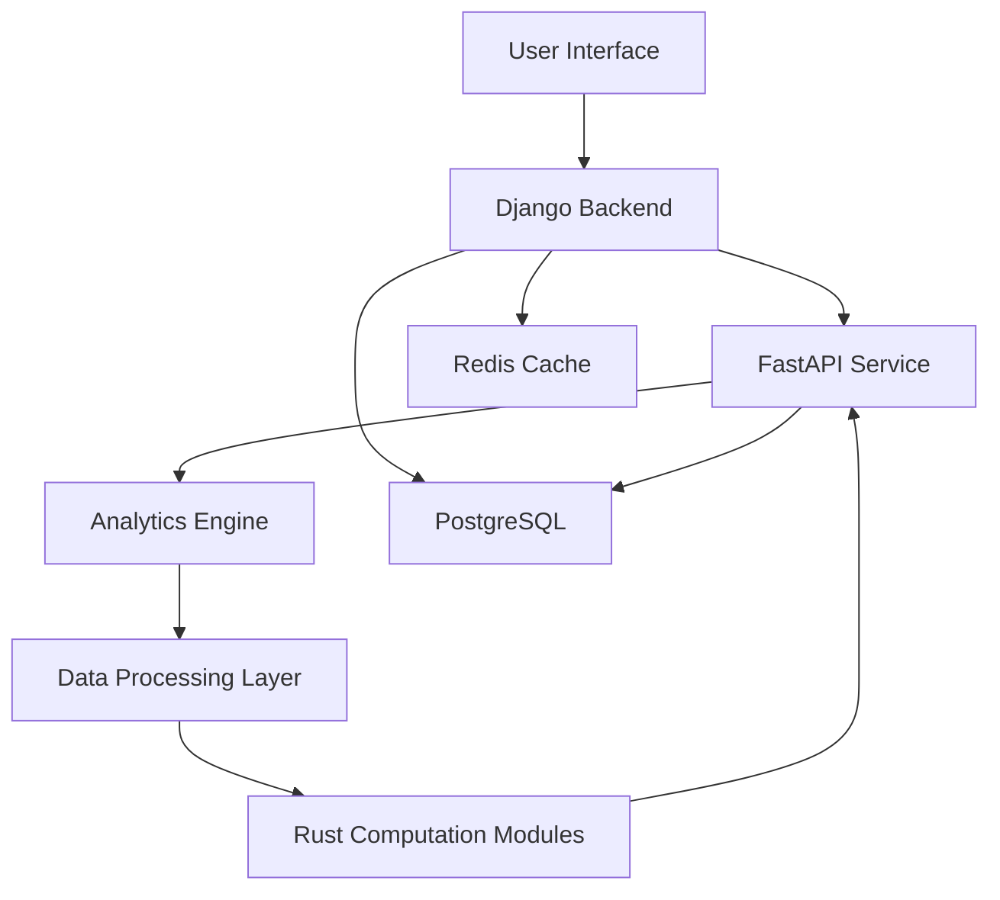

# Pea Protein Extraction Process Analysis System
## Comprehensive Project Development Plan

## Table of Contents
1. [Project Overview](#1-project-overview)
2. [Technical Architecture](#2-technical-architecture)
3. [Project Structure](#3-project-structure)
4. [Core System Components](#4-core-system-components)
5. [Mathematical Models and Algorithms](#5-mathematical-models-and-algorithms)
6. [API Design and Endpoints](#6-api-design-and-endpoints)
7. [Data Flow and Component Integration](#7-data-flow-and-component-integration)
8. [Development Phases](#8-development-phases)
9. [Testing Strategy](#9-testing-strategy)
10. [Deployment Strategy](#10-deployment-strategy)
11. [Documentation Requirements](#11-documentation-requirements)

## 1. Project Overview

### 1.1 Objective
Development of a comprehensive backend system for analyzing and comparing three pea protein extraction processes:
- Baseline dry fractionation
- RF (Radio Frequency) pre-treatment with dry fractionation  
- IR (Infrared) pre-treatment with dry fractionation

Key analysis components:
- Protein recovery tracking and separation efficiency
- Technical performance assessment (protein yield, purity, particle size)
- Economic analysis (CAPEX, OPEX, NPV)
- Environmental impact assessment using Life Cycle Assessment (LCA)
- Eco-efficiency analysis incorporating:
  - Economic indicators (NPV, Net Profit, Net Future Worth)
  - Environmental impacts (GWP, HCT, FRS, WC)
  - Product quality metrics (protein purity)
- Comparative analysis of processes including trade-off assessment

### 1.2 Technology Stack
- **Django**: Core application framework, user management, data handling
- **FastAPI**: Process-specific APIs, real-time calculations
- **Rust**: High-performance computations, simulations
- **PostgreSQL**: Primary database
- **Docker/Kubernetes**: Containerization and orchestration
- **Python Scientific Stack**: NumPy, Pandas, SciPy for economic and protein analysis
- **Statistics/Simulation Libraries**: Monte Carlo simulations, sensitivity analysis
- **Visualization Libraries**: Analysis result visualization
- **React**: Required frontend for analysis visualization

## 2. Technical Architecture

### 2.1 Component Overview
1. **Django Application**
   - User authentication and authorization
   - Database management and ORM
   - Task scheduling (Celery)
   - Result aggregation and reporting

2. **Analytics Engine**
   - Monte Carlo simulation module
   - Economic analysis module (NPV, ROI calculations)
   - LCA processing module
   - Eco-efficiency calculator
   - Statistical analysis module

3. **Data Processing Layer**
   - Protein yield calculator
   - Process efficiency analyzer
   - Environmental impact calculator

4. **FastAPI Application**
   - Process-specific calculations
   - Real-time analysis endpoints
   - Integration with Rust modules
   - Data validation and preprocessing
   - Process separation efficiency endpoints
   - Economic performance metrics 
   - Environmental impact assessment
   - Eco-efficiency indicators

5. **Rust Modules**
   - Monte Carlo simulations
   - Sensitivity analysis
   - Matrix operations
   - Performance optimization
   - Particle size distribution analysis
   - Protein recovery calculations
   - Environmental impact computations

6. **Database Layer**
   - PostgreSQL for persistent storage
   - Redis for caching
   - Time-series data management

### 2.2 Integration Architecture

# 3. Projuct Structure
project_root/
├── analytics/
│   ├── protein_analysis/
│   │   ├── __init__.py
│   │   ├── recovery.py
│   │   ├── separation.py
│   │   ├── particle_size.py
│   │   └── tests/
│   ├── economic/
│   │   ├── __init__.py
│   │   ├── capex.py
│   │   ├── opex.py
│   │   ├── profitability.py
│   │   └── tests/
│   ├── environmental/
│   │   ├── __init__.py
│   │   ├── lca.py
│   │   ├── impact_assessment.py
│   │   ├── eco_efficiency.py
│   │   └── tests/
│   └── simulation/
│       ├── __init__.py
│       ├── monte_carlo.py
│       ├── sensitivity.py
│       └── tests/
├── backend/
│   ├── django_app/
│   │   ├── settings/
│   │   │   ├── __init__.py
│   │   │   ├── base.py
│   │   │   ├── development.py
│   │   │   └── production.py
│   │   ├── process_data/
│   │   │   ├── models/
│   │   │   │   ├── __init__.py
│   │   │   │   ├── baseline.py
│   │   │   │   ├── rf_treatment.py
│   │   │   │   └── ir_treatment.py
│   │   │   ├── views/
│   │   │   ├── serializers/
│   │   │   └── tests/
│   │   ├── core/
│   │   │   ├── __init__.py
│   │   │   ├── models.py
│   │   │   ├── views.py
│   │   │   └── serializers.py
│   │   └── manage.py
│   ├── fastapi_app/
│   │   ├── main.py
│   │   ├── process_analysis/
│   │   │   ├── protein_endpoints.py
│   │   │   ├── economic_endpoints.py
│   │   │   └── environmental_endpoints.py
│   │   ├── services/
│   │   │   ├── calculations.py
│   │   │   └── helpers.py
│   │   ├── models/
│   │   │   ├── process.py
│   │   │   ├── economics.py
│   │   │   └── environment.py
│   │   └── tests/
│   └── rust_modules/
│       ├── src/
│       │   ├── lib.rs
│       │   ├── protein_analysis/
│       │   │   ├── mod.rs
│       │   │   └── particle_size.rs
│       │   ├── monte_carlo/
│       │   │   ├── mod.rs
│       │   │   └── simulation.rs
│       │   └── matrix_ops/
│       │       ├── mod.rs
│       │       └── operations.rs
│       ├── tests/
│       └── Cargo.toml
├── frontend/
│   ├── src/
│   │   ├── components/
│   │   │   ├── analysis/
│   │   │   │   ├── ProteinAnalysis.tsx
│   │   │   │   ├── EconomicAnalysis.tsx
│   │   │   │   └── EnvironmentalAnalysis.tsx
│   │   │   └── visualization/
│   │   └── pages/
│   ├── public/
│   └── package.json
├── database/
│   ├── migrations/
│   ├── scripts/
│   │   └── init_db.sql
│   └── Dockerfile
├── tests/
│   ├── integration/
│   └── unit/
├── docs/
├── docker-compose.yml
└── README.md

# 4. Core System Components

### 4.1 Django Models
```python
class Equipment(models.Model):
    name = models.CharField(max_length=100)
    cost = models.DecimalField(max_digits=10, decimal_places=2)
    efficiency = models.FloatField()
    maintenance_cost = models.DecimalField(max_digits=10, decimal_places=2)
    energy_consumption = models.FloatField()
    processing_capacity = models.FloatField()

class ProcessStep(models.Model):
    name = models.CharField(max_length=100)
    input_mass = models.FloatField()
    output_mass = models.FloatField()
    protein_content = models.FloatField()
    moisture_content = models.FloatField()
    particle_size_d10 = models.FloatField()
    particle_size_d50 = models.FloatField()
    particle_size_d90 = models.FloatField()
    equipment = models.ForeignKey(Equipment)

class TechnoEconomicAnalysis(models.Model):
    process_type = models.CharField(max_length=50)  # Baseline, RF, IR
    capex = models.DecimalField(max_digits=15, decimal_places=2)
    opex = models.DecimalField(max_digits=15, decimal_places=2)
    npv = models.DecimalField(max_digits=15, decimal_places=2)
    roi = models.FloatField()
    payback_period = models.FloatField()
    mcsp = models.DecimalField(max_digits=10, decimal_places=2)

class EnvironmentalAnalysis(models.Model):
    process_type = models.CharField(max_length=50)
    gwp = models.FloatField()  # Global Warming Potential
    hct = models.FloatField()  # Human Carcinogenic Toxicity
    frs = models.FloatField()  # Fossil Resource Scarcity
    wc = models.FloatField()   # Water Consumption
```

### 4.2 Process Analysis Services
```python
class ProteinAnalysisService:
    def calculate_protein_separation_efficiency(
        self,
        protein_yield: float,
        protein_content: float
    ) -> float:
        """PSE calculation from paper Section 3.1.2"""
        return protein_yield * protein_content

    def analyze_particle_distribution(
        self,
        particles: List[float]
    ) -> Dict[str, float]:
        """Particle size analysis from paper Table 2"""
        return {
            "D0.1": np.percentile(particles, 10),
            "D0.5": np.percentile(particles, 50),
            "D0.9": np.percentile(particles, 90)
        }

class EconomicAnalysisService:
    def calculate_total_capital_investment(
        self,
        equipment_costs: float,
        installation_factor: float = 0.2,
        indirect_costs_factor: float = 0.15
    ) -> float:
        """TCI calculation from paper Section 3.2.1"""
        direct_costs = equipment_costs * (1 + installation_factor)
        indirect_costs = direct_costs * indirect_costs_factor
        return direct_costs + indirect_costs

    def calculate_turn_over_ratio(
        self,
        annual_sales: float,
        fixed_capital_investment: float
    ) -> float:
        """TOR calculation from paper Section 3.2.4"""
        return annual_sales / fixed_capital_investment

    def calculate_mcsp(
        self,
        target_npv: float,
        costs: Dict[str, float],
        production_volume: float
    ) -> float:
        """MCSP calculation from paper Section 3.2.6"""
        # Implementation of minimum concentrate selling price calculation
        pass

class EnvironmentalAnalysisService:
    def calculate_impact_allocation(
        self,
        total_impact: float,
        product_values: Dict[str, float],
        allocation_method: str = "economic"
    ) -> Dict[str, float]:
        """Impact allocation from paper Section 3.3.3"""
        if allocation_method == "economic":
            total_value = sum(product_values.values())
            return {k: v/total_value * total_impact 
                   for k, v in product_values.items()}
```

# 5. Mathematical Models and Algorithms

### 5.1 Technical Performance Models
```python
def protein_recovery_efficiency(
    protein_yield: float,
    protein_content: float,
    separation_efficiency: float
) -> float:
    """
    Paper Section 3.1.1 - Protein yield and purity calculation
    """
    return (protein_yield * protein_content * separation_efficiency) / 100

def particle_size_analysis(d10: float, d50: float, d90: float) -> Dict[str, float]:
    """
    Paper Table 2 - Particle size distribution analysis
    """
    return {
        "fine_fraction": {"D0.1": d10, "D0.5": d50, "D0.9": d90},
        "distribution_width": (d90 - d10) / d50
    }
```

### 5.2 Economic Analysis Models
```python
def calculate_total_annualized_cost(
    capex: float,
    opex: float,
    project_years: int,
    interest_rate: float
) -> float:
    """
    Paper Section 3.2.3 - Total annualized production costs
    """
    annual_capital_charge = capex * interest_rate * (1 + interest_rate)**project_years / ((1 + interest_rate)**project_years - 1)
    return annual_capital_charge + opex

def calculate_profitability_metrics(
    cash_flows: List[float],
    initial_investment: float,
    discount_rate: float,
    project_years: int
) -> Dict[str, float]:
    """
    Paper Section 3.2.4 - Profitability analysis
    """
    npv = -initial_investment
    for t, cf in enumerate(cash_flows, 1):
        npv += cf / (1 + discount_rate)**t
    
    roi = (sum(cash_flows) / project_years) / initial_investment * 100
    
    return {
        "NPV": npv,
        "ROI": roi,
        "PI": (npv + initial_investment) / initial_investment
    }
```

### 5.3 Environmental Impact Models
```python
def calculate_environmental_metrics(
    energy_consumption: Dict[str, float],
    water_consumption: float,
    emission_factors: Dict[str, float]
) -> Dict[str, float]:
    """
    Paper Section 3.3.1 - Environmental impact calculations
    """
    gwp = sum(energy * emission_factors["GWP"] 
              for energy in energy_consumption.values())
    hct = sum(energy * emission_factors["HCT"] 
              for energy in energy_consumption.values())
    frs = sum(energy * emission_factors["FRS"] 
              for energy in energy_consumption.values())
    
    return {
        "GWP": gwp,
        "HCT": hct,
        "FRS": frs,
        "WC": water_consumption
    }
```

### 5.4 Eco-efficiency Models
```python
def calculate_eco_efficiency_indicators(
    economic_values: Dict[str, float],
    environmental_impacts: Dict[str, float],
    protein_purity: float
) -> Dict[str, float]:
    """
    Paper Section 3.4 - Eco-efficiency assessment
    """
    # Economic-based indicators
    ee_npv = economic_values["NPV"] / environmental_impacts["GWP"]
    ee_profit = economic_values["NetProfit"] / environmental_impacts["GWP"]
    
    # Quality-based indicator
    ee_quality = protein_purity / environmental_impacts["GWP"]
    
    return {
        "EE_NPV": ee_npv,
        "EE_Profit": ee_profit,
        "EE_Quality": ee_quality
    }

def calculate_relative_eco_efficiency(
    ee_alternative: float,
    ee_baseline: float
) -> float:
    """
    Paper Section 3.5 - Relative eco-efficiency calculation
    """
    return ee_alternative / ee_baseline
```

