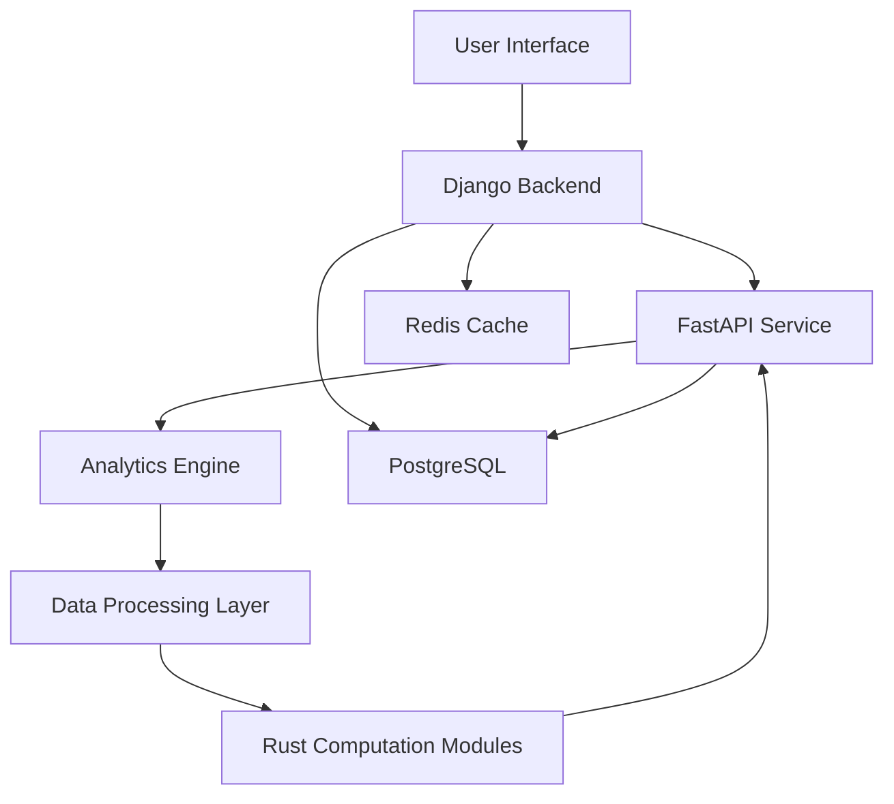

# Pea Protein Extraction Process Analysis System
## Comprehensive Project Development Plan

## Table of Contents
1. [Project Overview](#1-project-overview)
2. [Technical Architecture](#2-technical-architecture)
3. [Project Structure](#3-project-structure)
4. [Core System Components](#4-core-system-components)
5. [Mathematical Models and Algorithms](#5-mathematical-models-and-algorithms)
6. [API Design and Endpoints](#6-api-design-and-endpoints)
7. [Data Flow and Component Integration](#7-data-flow-and-component-integration)
8. [Development Phases](#8-development-phases)
9. [Testing Strategy](#9-testing-strategy)
10. [Deployment Strategy](#10-deployment-strategy)
11. [Documentation Requirements](#11-documentation-requirements)

## 1. Project Overview

### 1.1 Objective
Development of a comprehensive backend system for analyzing and comparing three pea protein extraction processes:
- Baseline dry fractionation
- RF (Radio Frequency) pre-treatment with dry fractionation  
- IR (Infrared) pre-treatment with dry fractionation

Key analysis components:
- Protein recovery tracking and separation efficiency
- Technical performance assessment (protein yield, purity, particle size)
- Economic analysis (CAPEX, OPEX, NPV)
- Environmental impact assessment using Life Cycle Assessment (LCA)
- Eco-efficiency analysis incorporating:
  - Economic indicators (NPV, Net Profit, Net Future Worth)
  - Environmental impacts (GWP, HCT, FRS, WC)
  - Product quality metrics (protein purity)
- Comparative analysis of processes including trade-off assessment

### 1.2 Technology Stack
- **Django**: Core application framework, user management, data handling
- **FastAPI**: Process-specific APIs, real-time calculations
- **Rust**: High-performance computations, simulations
- **PostgreSQL**: Primary database
- **Docker/Kubernetes**: Containerization and orchestration
- **Python Scientific Stack**: NumPy, Pandas, SciPy for economic and protein analysis
- **Statistics/Simulation Libraries**: Monte Carlo simulations, sensitivity analysis
- **Visualization Libraries**: Analysis result visualization
- **React**: Required frontend for analysis visualization

## 2. Technical Architecture

### 2.1 Component Overview
1. **Django Application**
   - User authentication and authorization
   - Database management and ORM
   - Task scheduling (Celery)
   - Result aggregation and reporting

2. **Analytics Engine**
   - Monte Carlo simulation module
   - Economic analysis module (NPV, ROI calculations)
   - LCA processing module
   - Eco-efficiency calculator
   - Statistical analysis module

3. **Data Processing Layer**
   - Protein yield calculator
   - Process efficiency analyzer
   - Environmental impact calculator

4. **FastAPI Application**
   - Process-specific calculations
   - Real-time analysis endpoints
   - Integration with Rust modules
   - Data validation and preprocessing
   - Process separation efficiency endpoints
   - Economic performance metrics 
   - Environmental impact assessment
   - Eco-efficiency indicators

5. **Rust Modules**
   - Monte Carlo simulations
   - Sensitivity analysis
   - Matrix operations
   - Performance optimization
   - Particle size distribution analysis
   - Protein recovery calculations
   - Environmental impact computations

6. **Database Layer**
   - PostgreSQL for persistent storage
   - Redis for caching
   - Time-series data management

### 2.2 Integration Architecture

[Continue with remaining sections...]